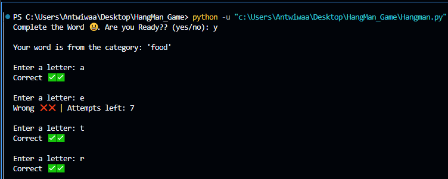
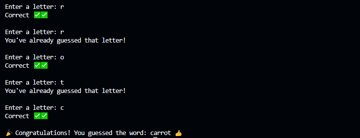

# HangMan_Game
This is a simple Hangman game implemented in Python. The game selects a word from a predefined list stored in a JSON file and allows the player to guess the word letter by letter. The player has a limited number of attempts to guess the word correctly before the game ends.

## How To Use This Repository
```#Clone the repository to your local machine.
  https://github.com/Antwiwaa-tech/HangMan_Game.git

  #Navigate to the directory where you cloned it.
  cd HangMan_Game

  #Run the provided Python scripts in your terminal.
  python3 HangMan.py

  #Follow the prompts in each script to interact with the programs.
  ```

## Features
- Loads words from a JSON file.
- Randomly selects a word from a category.
- Allows players to guess letters one at a time.
- Tracks the number of incorrect guesses.
- Provides a maximum of 7 incorrect attempts before ending the game.
- Displays a congratulatory message when the player guesses the word correctly.
- Allows users to exit the game at any time by typing 'quit'.

## How to Play
1. The game randomly selects a word from a category.
2. You are prompted to guess a letter.
3. If the letter is in the word, it is revealed.
4. If the letter is incorrect, you lose an attempt.
5. You have a maximum of 7 incorrect guesses.
6. Type `quit` to exit the game at any time.
7. The game ends when you either guess the word correctly or exhaust all attempts.

## Example Gameplay


